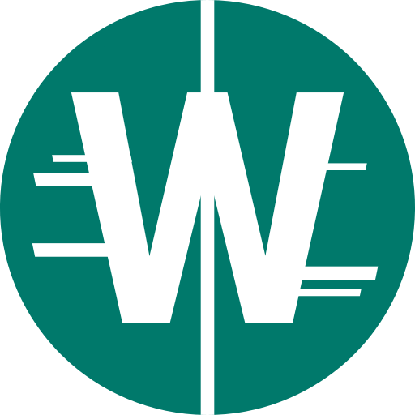

<p align="center">
  <a href="https://which-ecosystem.github.io/" rel="noopener" target="_blank"></a></p>
</p>
<h1 align="center"> Which </h1>

<p align="center">Social web-app focused on choosing between two images.</p>

<p align="center"><i>"Which one do <b>you</b> like?"</i></p>

## Development :hammer_and_wrench:
Track our progress - [KANBAN board](https://github.com/orgs/which-ecosystem/projects/1):fire:

### Technology stack
- [React.js](https://reactjs.org) :rocket:
- [Typescript](https://www.typescriptlang.org/) :label:
- [Material-ui](https://material-ui.com/) :lipstick:

### Building and running
```
npm i
npm start
```
